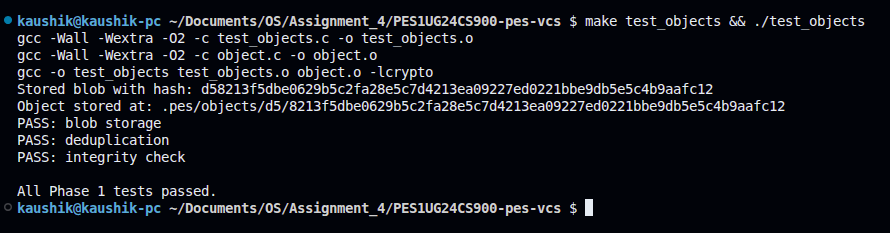
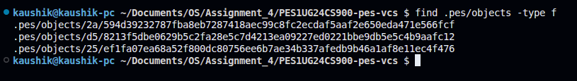
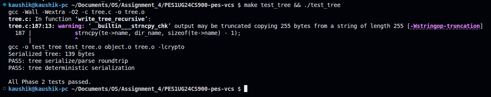
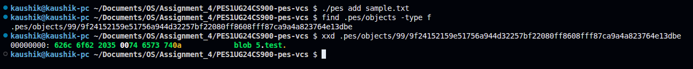
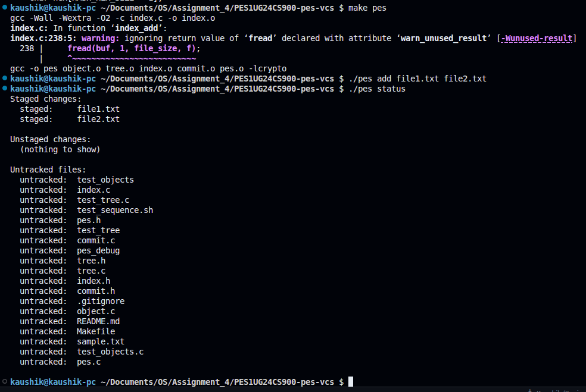
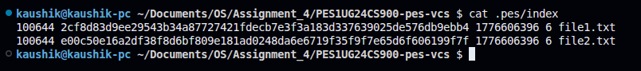
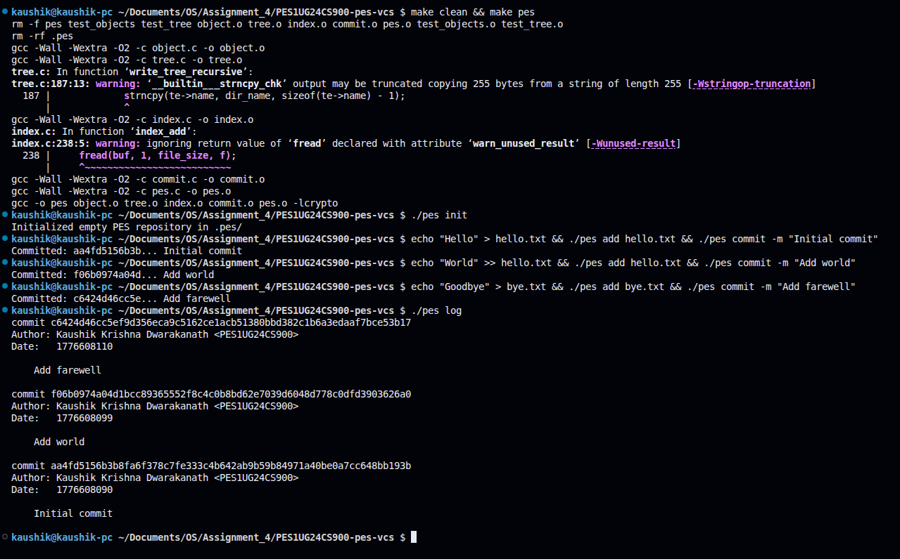
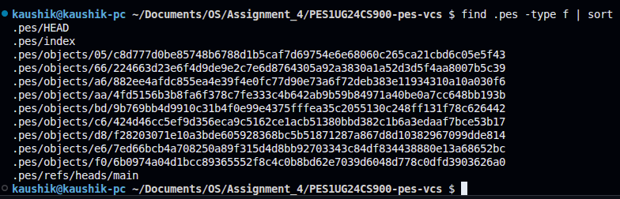
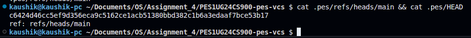
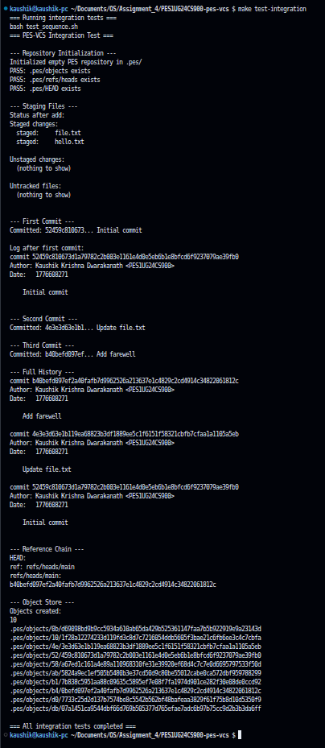

# PES-VCS Lab Report — Building a Version Control System from Scratch

**Name:** Kaushik Krishna Dwarakanath
**SRN:** PES1UG24CS900

---

## Table of Contents
1. [Phase 1 — Object Store](#phase-1--object-store)
2. [Phase 2 — Tree Objects](#phase-2--tree-objects)
3. [Phase 3 — Staging Area](#phase-3--staging-area)
4. [Phase 4 — Commits and History](#phase-4--commits-and-history)
5. [Phase 5 — Branching Analysis](#phase-5--branching-analysis)
6. [Phase 6 — Garbage Collection Analysis](#phase-6--garbage-collection-analysis)

---

## Phase 1 — Object Store

### What was implemented
- `object_write`: builds a header of the form `"<type> <size>\0"`, appends the data, computes the SHA-256 hash of the full object, checks for deduplication, creates the shard directory (`.pes/objects/XX/`), writes to a temp file, calls `fsync`, and atomically renames to the final path.
- `object_read`: reads the file at the hashed path, recomputes the SHA-256 to verify integrity, parses the header to extract the type and size, and returns the data portion.

### Screenshot 1A — `./test_objects` output

### Screenshot 1B — Object store directory structure

---

## Phase 2 — Tree Objects

### What was implemented
- `tree_from_index`: loads the index, then calls `write_tree_recursive` which groups index entries by their top-level directory component. Flat files are added directly as tree entries. For subdirectories, all entries sharing the same prefix are collected and the function recurses, producing a subtree object. Each level is serialized with `tree_serialize` and written with `object_write(OBJ_TREE, ...)`.
- A `__attribute__((weak))` stub for `index_load` was added so the `test_tree` binary links correctly without `index.o`.

### Screenshot 2A — `./test_tree` output

### Screenshot 2B — `xxd` of a raw tree object

---

## Phase 3 — Staging Area

### What was implemented
- `index_load`: opens `.pes/index` and parses each line in the format `<mode> <hex> <mtime> <size> <path>` using `fscanf`, converting the hex string to a binary `ObjectID` with `hex_to_hash`.
- `index_save`: heap-allocates a copy of the index (to avoid stack overflow from the large struct), sorts entries by path using `qsort`, writes to a temp file using `fprintf`, calls `fflush` + `fsync`, then atomically renames to `.pes/index`.
- `index_add`: reads the file into a heap buffer, writes it as a blob with `object_write(OBJ_BLOB, ...)`, calls `lstat` to get metadata, then updates or adds the index entry and calls `index_save`.

### Screenshot 3A — `pes init` → `pes add` → `pes status`

### Screenshot 3B — `cat .pes/index`

---

## Phase 4 — Commits and History

### What was implemented
- `commit_create`: calls `tree_from_index` to snapshot the staged state into a tree object, reads HEAD via `head_read` to get the parent commit (if any), fills a `Commit` struct with the author from `pes_author()`, the current Unix timestamp, and the message, serializes it with `commit_serialize`, writes it with `object_write(OBJ_COMMIT, ...)`, and finally calls `head_update` to atomically point the current branch at the new commit.

### Screenshot 4A — `./pes log` showing three commits

### Screenshot 4B — `find .pes -type f | sort`

### Screenshot 4C — `cat .pes/refs/heads/main` and `cat .pes/HEAD`

### Final Screenshot — `make test-integration`

---

## Phase 5 — Branching Analysis

### Q5.1 — How would you implement `pes checkout <branch>`?

A branch in `.pes/` is just a file at `.pes/refs/heads/<branch>` containing a commit hash. To implement `pes checkout <branch>`, the following steps are required:

1. **Read the target branch ref** — open `.pes/refs/heads/<branch>` and read the commit hash it contains.
2. **Walk the target commit's tree** — parse the commit object to get its root tree hash, then recursively walk the tree to enumerate all files and their blob hashes.
3. **Update the working directory** — for each file in the target tree, read the blob from the object store and write its contents to the corresponding path on disk. Files that exist in the current tree but not the target tree must be deleted.
4. **Update the index** — rebuild `.pes/index` to reflect the target tree's contents.
5. **Update HEAD** — write `ref: refs/heads/<branch>` to `.pes/HEAD`.

The operation is complex because it must handle three categories of files simultaneously: files that are the same in both branches (no action needed), files that differ (must be overwritten), and files that exist in only one branch (must be created or deleted). It also must refuse to proceed if the working directory has uncommitted changes that would be overwritten, to prevent data loss.

### Q5.2 — How would you detect a dirty working directory conflict?

To detect whether a checkout would destroy uncommitted local changes, the following algorithm is used:

1. For each entry in the current index, call `lstat` on the file to get its current `mtime` and `size`. If either differs from the stored values in the index entry, the file has been modified since it was staged.
2. For files identified as modified, recompute their SHA-256 hash and compare it against the blob hash stored in the index. If the hashes differ, the file is genuinely dirty (not just a metadata change).
3. Check whether the same file path exists in the target branch's tree with a different blob hash. If it does, checking out would overwrite the local modification.
4. If any file is both locally modified and different in the target branch, abort the checkout and report a conflict.

This approach uses only the index and the object store — no diff tools or external state are needed. The metadata fast-path (mtime + size) avoids re-hashing every file for the common case where nothing has changed.

### Q5.3 — What happens when you commit in detached HEAD state?

In detached HEAD state, `.pes/HEAD` contains a raw commit hash instead of `ref: refs/heads/<branch>`. When `commit_create` calls `head_update`, it writes the new commit hash directly into HEAD rather than updating a branch ref file.

This means new commits are created and stored in the object store correctly, and HEAD advances with each commit. However, no branch pointer tracks these commits. As soon as the user runs `pes checkout <branch>`, HEAD is overwritten with the branch ref, and the chain of detached commits becomes unreachable — no ref in `.pes/refs/` points to them.

To recover these commits, the user would need to find the lost commit hash. In Git this is done with `git reflog`, which logs every position HEAD has pointed to. Without a reflog, the user would need to scan all objects in `.pes/objects/` to find commit objects not reachable from any branch, then manually create a branch pointing to the desired one with `git branch recovery-branch <hash>`.

---

## Phase 6 — Garbage Collection Analysis

### Q6.1 — Algorithm to find and delete unreachable objects

The algorithm is a **mark-and-sweep**:

**Mark phase:**
1. Initialize an empty hash set of reachable object IDs.
2. For every file in `.pes/refs/heads/`, read the commit hash it contains.
3. For each starting commit hash, walk the full parent chain: parse the commit, add its hash to the reachable set, add its tree hash, then recurse into that tree — adding every subtree and blob hash encountered.
4. Continue until all branches and their full histories have been traversed.

**Sweep phase:**
1. List every file under `.pes/objects/XX/` by scanning the directory tree.
2. Reconstruct the full object hash from the two-character shard directory name and the filename.
3. If the hash is not in the reachable set, delete the file.

The most efficient data structure for the reachable set is a **hash set** (e.g., a hash table keyed by the 32-byte object ID), giving O(1) average lookup and insertion.

**Estimate for 100,000 commits and 50 branches:** Assuming each commit references an average of 10 unique objects (blobs and trees not shared with parent), the total reachable object count is approximately 1,000,000. The mark phase visits each reachable object once, so roughly **1,000,000 objects** are visited. The sweep phase then scans all files in the object store directory tree, which could be larger if many unreachable objects have accumulated.

### Q6.2 — Race condition between GC and concurrent commit

The race condition proceeds as follows:

1. **GC starts the mark phase** and builds its reachable set from the current branch refs.
2. **A concurrent commit begins** — `object_write` is called and successfully writes a new blob to `.pes/objects/`. However, the commit object that will reference this blob has not been written yet.
3. **GC finishes the mark phase** — the new blob is not reachable from any branch or commit (the commit object doesn't exist yet), so it is not in the reachable set.
4. **GC runs the sweep phase** and deletes the new blob, since it appears unreachable.
5. **The concurrent commit finishes** — it writes the commit object that references the deleted blob and updates HEAD. The repository is now corrupt: the commit points to a blob that no longer exists on disk.

**How Git avoids this:** Git's garbage collector (`git gc`) uses a **grace period** — any object whose file modification time is newer than a configurable threshold (default: 2 weeks for loose objects) is never deleted, regardless of reachability. This means a blob written seconds ago by a concurrent operation is always safe. Additionally, Git writes objects before writing the refs or commits that point to them, so the window of vulnerability is minimized. For very tight safety, Git also supports repository locks during GC on certain backends.
